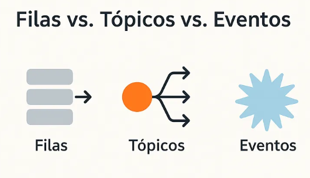

Durante a concepção e o desenho de uma solução, é comum haver confusão sobre quando utilizar **filas, tópicos ou eventos**. Essas três abordagens desempenham papéis fundamentais na arquitetura de software, mas muitas vezes são aplicadas sem uma compreensão clara de suas diferenças e melhores casos de uso.

Neste artigo, vamos explicar de forma **resumida e prática** as diferenças entre esses conceitos e como aplicá-los corretamente.

Trago aqui um exemplo prático baseado no contexto de uma **corretora de investimentos**.

---

## Conceitos Básicos

### 📌 1. Filas

Filas seguem o modelo **FIFO (First In, First Out)** e são ideais para **distribuição de trabalho** entre consumidores. Uma mensagem inserida na fila é consumida por **apenas um consumidor** e removida após o processamento.

#### ✔ Quando usar?

- Quando uma tarefa precisa ser processada **apenas uma vez**.
- Para **balanceamento de carga** entre várias instâncias de um serviço.
- Para garantir **resiliência a falhas**, evitando perda de mensagens.

#### 💡 Exemplo prático:

Um sistema de **processamento de pagamentos** pode colocar requisições de cobrança em uma fila (ex: **AWS SQS**) para serem processadas por **workers** de forma assíncrona.

---

### 📌 2. Tópicos

Tópicos são utilizados no modelo **publish-subscribe (pub/sub)**, onde uma mensagem **é publicada e pode ser recebida por múltiplos consumidores**. Aqui, **não existe um modelo FIFO padrão**, pois a mesma mensagem é entregue a diversos assinantes.

#### ✔ Quando usar?

- Quando **vários sistemas** precisam consumir a mesma informação.
- Para **processamento em tempo real** e **streaming de dados**.
- Para **separação de responsabilidades** entre consumidores diferentes.

#### 💡 Exemplo prático:

Em uma plataforma de **trading**, os eventos de **preço das ações** podem ser publicados em um tópico (**Kafka**) e consumidos por vários serviços, como:

- **Dashboards de traders**
- **Sistemas de risco**
- **Mecanismos de execução automática**

---

### 📌 3. Eventos

Eventos representam **mudanças de estado** dentro do sistema. Eles são **registrados para que outros serviços possam reagir** conforme necessário. Diferente de filas e tópicos, **eventos não exigem consumidores imediatos**, eles são apenas um registro do que aconteceu.

#### ✔ Quando usar?

- Quando você quer **capturar e armazenar mudanças de estado** para futuras ações.
- Para sistemas **desacoplados** que precisam reagir a eventos assíncronos.
- Para **auditoria** e **logging** de eventos importantes no sistema.

#### 💡 Exemplo prático:

Quando um **pedido de compra** é executado em uma corretora, um evento é registrado no **AWS EventBridge**, permitindo que serviços de:

- **Notificação** (push para o app do investidor),
- **Auditoria** (registro para fins regulatórios),
- **Relatórios** (dados para análise de trading),  
  possam reagir à mudança **sem que a aplicação principal precise chamá-los diretamente**.

---

## 🏦 Exemplo Prático: Arquitetura em uma Corretora de Investimentos

Agora que entendemos as diferenças básicas, vamos aplicar esses conceitos ao **contexto de uma corretora de investimentos**, onde desenvolvemos uma solução para processar **ordens de compra e venda de ativos**.

1️⃣ **Entrada da Ordem**

- O investidor envia uma ordem via **frontend**.
- A ordem é enviada para processamento no **backend (ECS Fargate)**.

2️⃣ **Enfileiramento da Ordem**

- A ordem é publicada em um **tópico Kafka**, pois precisamos que **vários serviços** consumam esse evento (ex: **regras de negócio, logging, risco**).

3️⃣ **Processamento da Ordem**

- O **backend** recebe a ordem do Kafka e a processa:
  - **Validação** (verifica saldo, limites, etc.).
  - **Cálculo e regras de negócio**.
  - **Chamadas a APIs externas** para confirmação.
- Após a validação, a ordem é colocada em uma **fila AWS SQS** para ser processada **de forma assíncrona** pelos serviços responsáveis por interagir com a bolsa de valores.

4️⃣ **Envio da Ordem à Bolsa**

- Um **worker** consome a ordem da fila **AWS SQS** e a envia à **B3 via APIs**.
- Isso garante **resiliência e balanceamento de carga** na comunicação com a bolsa.

5️⃣ **Geração de Eventos e Notificações**

- Quando a ordem muda de status, publicamos um evento no **AWS EventBridge**.
- O **EventBridge** pode notificar:
  - Um **serviço de notificação**, que envia um push para o app do investidor.
  - **Serviços de auditoria**, que gravam logs para fins regulatórios.
  - **Módulos de análise**, que usam os dados para relatórios de trading.

---

## 📌 Conclusão

Na prática, **filas, tópicos e eventos têm propósitos distintos**, e escolher a abordagem correta **depende do problema que estamos resolvendo**.

- **Filas** → Garantem processamento individualizado e confiável.
- **Tópicos** → Distribuem informações para múltiplos interessados.
- **Eventos** → Criam sistemas desacoplados e reativos.

No caso da **corretora**, utilizamos:
✅ **Kafka** → Para distribuição de eventos da ordem.  
✅ **AWS SQS** → Para processamento assíncrono.  
✅ **EventBridge** → Para disparar eventos de status.

Esse modelo garante **flexibilidade, escalabilidade e uma arquitetura resiliente** para lidar com **alto volume de transações**.

Espero que esse artigo tenha ajudado a esclarecer as diferenças entre esses conceitos e como aplicá-los em **soluções reais**! 🚀

Se você tiver outras abordagens ou experiências diferentes, **compartilhe nos comentários lá do nosso post no Linkedin**!

---
